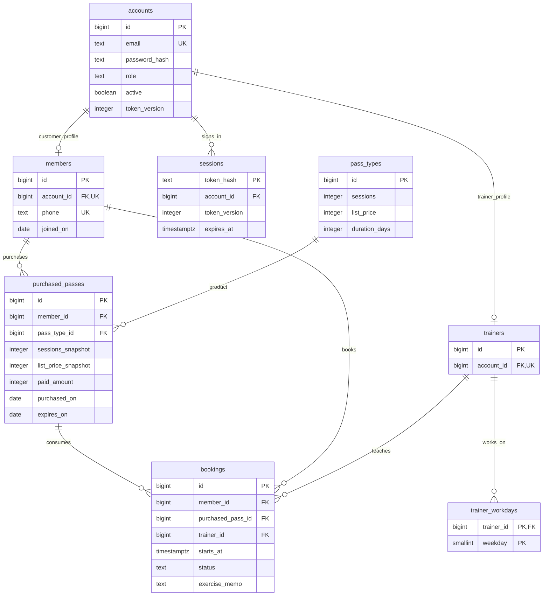

# ERD

```mermaid
erDiagram
  accounts ||--o| members : customer_profile
  accounts ||--o| trainers : trainer_profile
  accounts ||--o{ sessions : signs_in
  trainers ||--o{ trainer_workdays : works_on
  members ||--o{ purchased_passes : purchases
  pass_types ||--o{ purchased_passes : product
  purchased_passes ||--o{ bookings : consumes
  members ||--o{ bookings : books
  trainers ||--o{ bookings : teaches
  accounts {
    bigint id PK
    text email UK
    text password_hash
    text role
    boolean active
    integer token_version
  }
  members {
    bigint id PK
    bigint account_id FK,UK
    text phone UK
    date joined_on
  }
  trainers {
    bigint id PK
    bigint account_id FK,UK
  }
  trainer_workdays {
    bigint trainer_id PK,FK
    smallint weekday PK
  }
  pass_types {
    bigint id PK
    integer sessions
    integer list_price
    integer duration_days
  }
  purchased_passes {
    bigint id PK
    bigint member_id FK
    bigint pass_type_id FK
    integer sessions_snapshot
    integer list_price_snapshot
    integer paid_amount
    date purchased_on
    date expires_on
  }
  bookings {
    bigint id PK
    bigint member_id FK
    bigint purchased_pass_id FK
    bigint trainer_id FK
    timestamptz starts_at
    text status
    text exercise_memo
  }
  sessions {
    text token_hash PK
    bigint account_id FK
    integer token_version
    timestamptz expires_at
  }
```

bookings의 purchased_pass_id와 member_id는 purchased_passes의 id와 member_id를 함께 참조합니다. schema_migrations는 초기화 버전을 기록하는 내부 관리 테이블입니다. pass_balances는 별도 원본 테이블이 아닌 계산용 뷰입니다.
